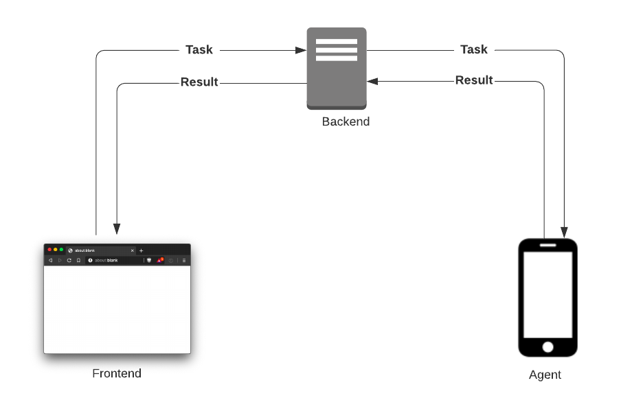
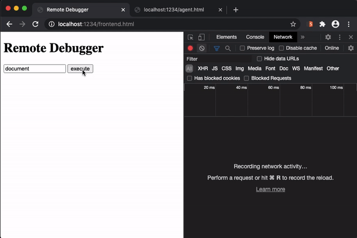

# remote-js-debugger

*Non-productive PoC*: Evaluate JavaScript in the context of a remote web site and receive the results.

**Disclaimer**: *Any information shared within this repository must not be used with malicious intentions. Proof-of-Concepts and tools are shared for educational purpose only. Any malicious use will not hold the author responsible*.


## Components
The debugger uses a server-client scenario with the following components:
* Backend
    * Core of the debugger is a Node.js server that receives "tasks" (= JavaScript), instructs the *agent* to execute the JavaScript and provides the resulting output to a frontend.
* Frontend
    * The *frontend* is used to specify JavaScript that should be evaluated by the *agent* and render the received output.
* Agent
    * The *agent* executes provided JavaScripts and forwards the results to the *backend* component.

Idealized example setup:      


Frontend demo:     


## Setup
1. Launch backend component:
```bash
$ node backend.js
```
2. Inject *agent* to web page. For instance, intercept traffic using a Burp Suite instance and modify a legitimate respone.
3. Browse the `frontend.html` and interact with the agent.


## ToDos
 - [x] Implement HTTPS
 - [ ] Implement Jython based Burp Extension as frontend
